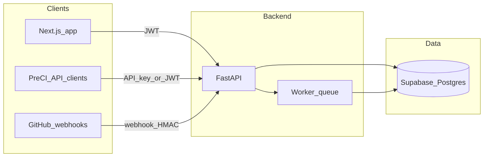

# Detailed first steps toward the MVP (FastAPI + Next.js + Supabase)

## How the stack maps to the product

| Concern                                                   | Primary owner                                        | Notes                                                                                                        |
| --------------------------------------------------------- | ---------------------------------------------------- | ------------------------------------------------------------------------------------------------------------ |
| Auth (users/orgs), row-level security                     | [Supabase](https://supabase.com) Auth + Postgres RLS | Use Supabase JWT in FastAPI for user-scoped routes                                                           |
| Durable entities (repos, PRs, graph snapshots, job state) | Supabase Postgres                                    | FastAPI reads/writes via `supabase-py` or direct Postgres (SQLAlchemy/asyncpg) with service role for workers |
| GitHub webhooks, clone/analyze, scoring                   | **FastAPI** (+ background worker)                    | Too heavy for Edge Functions; keep analysis off the Next.js server                                           |
| Dashboard UI                                              | **Next.js (App Router)** + React                     | Server Components for auth-gated pages; client for graph/interaction                                         |

## Principle: narrow the first “vertical slice”

`[idea.txt](idea.txt)` lists many MVP features (A–J). Building them in parallel fails. The **first slice** that proves value matches Section 22’s wedge:

- Connect **one GitHub repo** per team.
- On **PR open/sync**, compute **dependency changes** + **blast-radius** from **static** dependency graph (one ecosystem first).
- Expose a **pre-CI HTTP API** that accepts a commit range or PR and returns the same JSON summary.
- Show a **minimal dashboard**: repo list, latest PR analyses, human-readable summary (graph visualization can start as a simple list/tree, then upgrade).

**Defer to later MVP phases (not first steps):** post-CI enrichment, full drift monitor, cross-branch semantic conflict prediction, prompt/workflow graph, polished D3 graph, multi-language.

---

## Phase 0 — Project foundation (days 1–3)

**Repository layout (recommended monorepo)**

- `frontend/` — Next.js 14+ (App Router), TypeScript, UI library of your choice (e.g. Tailwind + shadcn if you want speed).
- `backend/` — FastAPI, Python 3.11+, `uv` or `poetry` for lockfile.
- `packages/shared` (optional) — OpenAPI-generated TypeScript types or shared Zod schemas if you adopt contract-first API.

**Environment and secrets**

- Supabase: project URL, anon key (web), service role key (API/worker only—never in browser).
- GitHub: register a **GitHub App** (recommended for webhooks + installation tokens) or start with OAuth + PAT for a single design partner; plan to migrate to App before wider beta.
- Shared `APP_BASE_URL` for webhook callback and OAuth redirects.

**CI**

- Lint + typecheck + test on PR for both apps (GitHub Actions).

**Definition of done:** both apps start locally; health checks pass; env documented in a single place (e.g. `.env.example` files per app).

---

## Phase 1 — Supabase: identity and core schema (days 3–7)

**Auth**

- Enable Supabase Auth (email/password, email magic link, and/or Google/GitHub OAuth via Supabase—pick one primary path for MVP clarity).
- Next.js: use `@supabase/ssr` for cookie-based sessions; protect routes via middleware.
- **Login and signup UI (first-class in v0.1):** dedicated routes **`/login`** and **`/signup`** with forms that call Supabase (`signInWithPassword`, `signUp`, or OAuth redirect). Include cross-links (“Don’t have an account? Sign up”, “Already have an account? Log in”), validation/error states, email confirmation messaging if enabled in Supabase, and post-auth redirect to `/dashboard` (or a pending invite URL later). Unauthenticated users hitting protected routes redirect to `/login` with a `next` query param where useful.

**Multi-tenancy**

- Tables: `organizations`, `organization_members` (role: owner/admin/member), link Supabase `auth.users` to your profile row.

**GitHub linkage**

- `github_installations` (or `github_connections`): `installation_id`, `account_login`, encrypted tokens or rely on GitHub App JWT flow at request time (prefer not storing long-lived tokens if avoidable).
- `repositories`: `org_id`, GitHub `repo_id`, `full_name`, default branch, sync state.

**Analysis artifacts (graph-first)**

- `analyses` or `pr_analyses`: `repo_id`, `pr_number` (or `commit_sha` range), status (`pending`/`running`/`completed`/`failed`), `summary_json` (blast radius, lists, scores), `created_at`.
- `dependency_snapshots`: optional cache of parsed graph per `repo_id` + `commit_sha` for reuse.

**RLS**

- Policies so members only see their org’s rows; service role bypasses RLS for workers.

**Definition of done:** user can **sign up** and **sign in** via the web app (`/signup`, `/login`); org/repo rows can be created (manually or via API) and are isolated by RLS.

---

## Phase 2 — FastAPI core API + auth (days 5–10)

**Middleware**

- Verify Supabase JWT on user routes (`Authorization: Bearer`).
- Separate auth for **machine clients** (pre-CI API): API keys stored hashed in Postgres, scoped to org/repo, rate-limited.

**Endpoints (minimal)**

- `GET /health`
- `POST /internal/github/webhook` — verify signature; enqueue “sync installation” or “analyze PR” job.
- `POST /v1/repos/{id}/analyze` — trigger analysis for a PR or SHAs (body: `base_sha`, `head_sha` or `pr_number`).
- `GET /v1/repos/{id}/analyses/{analysis_id}` — poll result.
- `GET /v1/repos/{id}/analyses/latest` — convenience for dashboard.

**Worker model**

- Use **Redis + RQ/Celery** or **Dramatiq**, or Supabase **pgmq** / external queue—pick one early. Start with async `BackgroundTasks` only for prototyping; move to a real queue before production load.

**Definition of done:** authenticated user can trigger an analysis job that writes a row in `pr_analyses` with `status` transitions.

---

## Phase 3 — Ingestion v1: one ecosystem (days 10–20)

**Pick one first** (align with your first design partner):

- **TypeScript/JavaScript:** `package.json` / `package-lock.json` or `pnpm-lock.yaml` for dependency **version** changes; static **import** graph via `typescript` compiler API, `ts-morph`, or `madge`-style resolution limited to repo boundaries.
- **Python:** `pyproject.toml` / `requirements` + `ast` for imports.

**Pipeline**

1. Fetch repo archive at `base_sha` and `head_sha` (GitHub API tarball) or shallow clone in worker temp dir.
2. Build **module/file graph** (nodes = files or packages; edges = imports / package deps).
3. Diff: changed files from Git compare API; **dependency edges changed** = edges present in one graph but not the other (or lockfile diff for package deps).
4. **Blast radius v1:** from the set of changed files, traverse **reverse** edges (who imports this) up to a cap (depth/breadth limits) to list impacted modules; assign a **heuristic score** (e.g. depth-weighted count + fan-out).

**Ownership**

- Parse `CODEOWNERS` at `head_sha`; map impacted paths to GitHub handles/teams for “who to contact” v1.

**Output shape (store in `summary_json`)**

- `changed_files`, `changed_dependency_edges`, `impacted_modules`, `blast_radius_score`, `confidence` (honest constant or simple heuristic), `suggested_reviewers` from CODEOWNERS, `risks[]` (string reasons).

**Definition of done:** for a real open-source repo or your own test repo, a PR produces a stored analysis with non-empty impacted modules when imports fan out.

---

## Phase 4 — Next.js dashboard (days 15–25, parallelizable)

**Auth pages (ship before or alongside dashboard)**

- **`/login`** — sign-in form (and OAuth buttons if enabled); link to `/signup`.
- **`/signup`** — registration form (same auth methods as login); link to `/login`; handle Supabase email-confirmation flow if required by project settings.

**App pages**

- `/dashboard`, `/orgs/[orgId]/repos`, `/repos/[repoId]` — latest analyses list.
- `/repos/[repoId]/analyses/[analysisId]` — summary UI: sections for dependency changes, blast radius, suggested reviewers (from Section 11 “what the user actually sees”—minimal version).

**Graph**

- v1: collapsible tree or table of impacted nodes; v2: force-directed graph (React Flow / Cytoscape) using the same JSON.

**Definition of done:** user can complete signup and login in the UI; authenticated user sees the same analysis information as the API response, without Postman.

---

## Phase 5 — Pre-CI API productization (days 20–28)

- Document `POST /v1/.../analyze` for CI or local CLI: auth via API key, idempotency key header optional.
- Return **stable JSON schema** and **HTTP 202** + poll pattern (or webhook callback later).
- Add basic **rate limits** and **audit log** (who triggered, which repo).

This matches `[idea.txt](idea.txt)` Section 9.C (“pre-CI API checks”) as the sharp wedge.

---

## Phase 6 — Next MVP pillars (after the vertical slice)

Order suggested by dependency and value:

1. **Branch drift monitor (narrow):** compare `main` vs `feature` — file change counts, overlapping hot files, lockfile divergence; store `DriftSignal`-like rows. Avoid promising “semantic merge prediction” early (`[idea.txt](idea.txt)` Section 11 vs 19).
2. **GitHub PR comment or Check Run:** post summary back to PR (installation token).
3. **Post-CI hook:** optional CI webhook or GitHub Checks API to attach “predicted vs actual” when tests fail (Section 9.D).
4. **Prompt/workflow layer:** separate graph for prompt files only after static path is solid (Section 9.H).

---

## Risks and mitigations (from your doc)

- **Scope creep:** enforce a written “v0.1 exit criteria” checklist (one ecosystem, one repo, blast radius + dep diff + CODEOWNERS + API + dashboard).
- **Noise in static analysis:** cap graph size, label confidence, allow ignore patterns (`.dependency-map.yml`).
- **Platform risk:** own the “holistic summary + pre-CI + ownership routing” narrative in UX copy, not just raw graphs (`[idea.txt](idea.txt)` Sections 6–7).

---

## Suggested v0.1 exit criteria (concrete)

- Supabase auth + org + RLS working; **`/login` and `/signup` pages** functional end-to-end.
- GitHub App installed on at least one repo; webhooks received.
- Analysis job completes for a PR with `summary_json` populated.
- Pre-CI API callable with API key.
- Next.js displays summary for latest analysis.

---

## File-level starting points (once you scaffold)

- `[backend](backend)`: `main.py`, `routers/webhooks.py`, `routers/analyses.py`, `services/github_client.py`, `services/graph_builder.py`, `services/blast_radius.py`, `worker/tasks.py`.
- `[frontend](frontend)`: `middleware.ts` (Supabase session), `app/(auth)/login/page.tsx`, `app/(auth)/signup/page.tsx` (or `app/login`, `app/signup`), `app/(dashboard)/...`, API client calling FastAPI (server actions or route handlers with secrets server-side only).
- Supabase migrations: `supabase/migrations/*.sql` for tables above.

No code exists in this repo yet; the first engineering commit should be Phase 0 scaffolding plus Phase 1 initial migration.